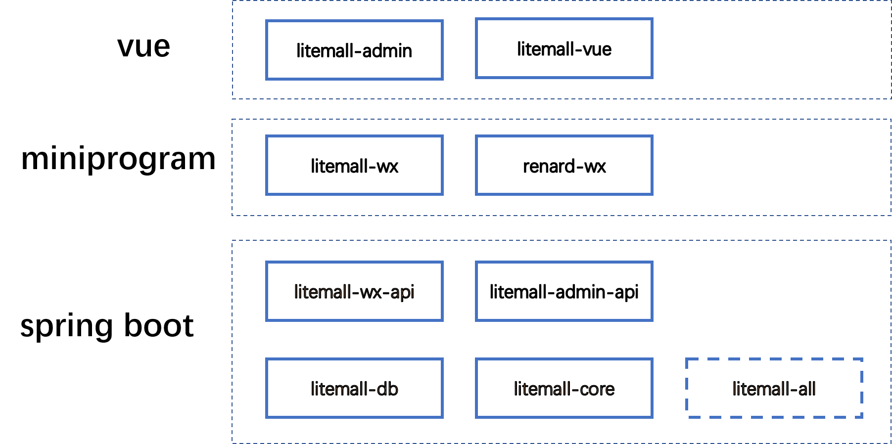

# golfoworld


golfoworld = Spring Boot后端 + Vue管理员前端 + 微信小程序用户前端 + Vue用户移动端


## 项目实例

### 小程序实例

### 管理后台实例


## 项目架构


## 技术栈

> 1. Spring Boot
> 2. Vue
> 3. 微信小程序



## 功能

### 小程序功能

* 首页
* 地址、收藏、足迹、意见反馈
* 客服

### 管理平台功能

* 会员管理


## 快速启动

1. 配置最小开发环境：
    * [MySQL](https://dev.mysql.com/downloads/mysql/)
    * [JDK1.8或以上](http://www.oracle.com/technetwork/java/javase/overview/index.html)
    * [Maven](https://maven.apache.org/download.cgi)
    * [Nodejs](https://nodejs.org/en/download/)
    * [微信开发者工具](https://developers.weixin.qq.com/miniprogram/dev/devtools/download.html)
    
2. 数据库依次导入golfoworld-db/sql下的数据库文件
    * golfoworld_schema.sql
    * golfoworld_table.sql
    * golfoworld_data.sql

3. 启动小程序和管理后台的后端服务

    打开命令行，输入以下命令
    ```bash
    cd golfoworld
    mvn install
    mvn clean package
    java -Dfile.encoding=UTF-8 -jar golfoworld-all/target/golfoworld-all-0.1.0-exec.jar
    ```
    
4. 启动管理后台前端

    打开命令行，输入以下命令
    ```bash
    npm install -g cnpm --registry=https://registry.npm.taobao.org
    cd golfoworld/golfoworld-admin
    cnpm install
    cnpm run dev
    ```
    此时，浏览器打开，输入网址`http://localhost:9527`, 此时进入管理后台登录页面。
    
5. 启动小程序前端
   
   这里存在两套小程序前端golfoworld-wx，开发者可以导入和测试：
   
   1. 微信开发工具导入golfoworld-wx项目;
   2. 项目配置，启用“不校验合法域名、web-view（业务域名）、TLS 版本以及 HTTPS 证书”
   3. 点击“编译”，即可在微信开发工具预览效果；
   4. 也可以点击“预览”，然后手机扫描登录（但是手机需开启调试功能）。
      

        
## 开发计划

V 1.0.0 完成以下目标：


V 2.0.0 完成以下目标：


V 3.0.0 完成以下目标：


